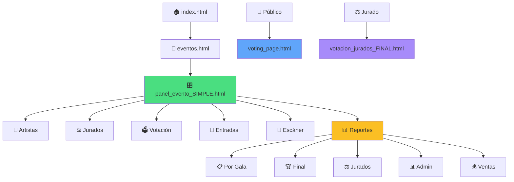

# 🔍 ANÁLISIS EXHAUSTIVO DEL SISTEMA VYTMUSIC QR
## Reporte Completo - Febrero 2026

---

## 📋 RESUMEN EJECUTIVO

**Fecha del Análisis:** 20 de febrero de 2026  
**Total de Archivos HTML:** 68  
**Archivos JavaScript Modulares:** 3  
**Estado General:** ✅ **SISTEMA FUNCIONAL CON ÁREAS DE OPTIMIZACIÓN**

### 🎯 Hallazgos Clave:
- ✅ Sistema principal funciona correctamente
- ⚠️ **3 escáneres QR diferentes** (redundancia identificada)
- ⚠️ **13 archivos de reportes** con overlaps funcionales
- ⚠️ **2 versiones de panel de control** (`panel_evento.html` vs `panel_evento_SIMPLE.html`)
- ✅ Links principales verificados y funcionales
- ⚠️ Referencias a archivos eliminados detectadas (`gestion_jurados.html`, `escaner_y_lista.html`)

---

## 🔗 1. ANÁLISIS DE LINKS ROTOS Y PROBLEMAS DE NAVEGACIÓN

### ✅ LINKS PRINCIPALES FUNCIONALES

#### Flujo de Navegación Principal (CORRECTO):
```
index.html 
  → eventos.html 
    → panel_evento_SIMPLE.html (RECOMENDADO)
      → [Funciones específicas]
```

#### Enlaces Verificados en `panel_evento_SIMPLE.html`:
| Función | Archivo Destino | Estado |
|---------|----------------|--------|
| 🎤 Artistas | `perfiles_artistas.html` | ✅ Existe |
| ⚖️ Jurados | `gestion_jurados_clean.html` | ✅ Existe |
| 🗳️ Votación Jurados | `votacion_jurados_FINAL.html` | ✅ Existe |
| 🎫 Lista QR | `lista_artistas_qr.html` | ✅ Existe |
| 🎫 Entradas | `generador_y_gestion.html` | ✅ Existe |
| 📱 Escáner QR | `escaner_rapido.html` | ✅ Existe |
| 📊 Reportes | `centro_reportes_unificado.html` | ✅ Existe |
| 👤 Asistentes | `gestion_asistentes.html` | ✅ Existe |
| 🚪 Entrada Puerta | `generador_entrada_puerta.html` | ✅ Existe |

#### Enlaces de Reportes (panel_evento_SIMPLE.html):
| Reporte | Archivo | Estado |
|---------|---------|--------|
| 📋 Por Gala | `reporte_por_gala.html` | ✅ Existe |
| 🏆 Final Certamen | `reporte_final_certamen_completo.html` | ✅ Existe |
| ⚖️ De Jurados | `reportes_jurado_artistas.html` | ✅ Existe |
| 📊 Administrativo | `reporte_administrativo_completo.html` | ✅ Existe |
| 💰 Ventas | `reporte_ventas_entradas.html` | ✅ Existe |

### ⚠️ REFERENCIAS A ARCHIVOS NO EXISTENTES

#### Archivo: `sistema_premios.html`
**Referencias a archivos eliminados:**
```javascript
'Escáner y Lista': 'escaner_y_lista.html'  // ❌ ARCHIVO NO EXISTE
```
**Impacto:** Bajo - archivo de sistema de premios no está en flujo principal  
**Recomendación:** Actualizar a `escaner_rapido.html` o `lista_artistas_qr.html`

#### Archivo: `sistema_testing_completo.html`
**Referencias a archivos no existentes:**
```javascript
window.open(`escaner_unificado.html?eventId=...`)  // ❌ ARCHIVO NO EXISTE
```
**Impacto:** Bajo - archivo de testing, no producción  
**Recomendación:** Actualizar a `escaner_rapido.html`

### ❌ ARCHIVOS MENCIONADOS EN DOCS PERO ELIMINADOS

| Archivo Mencionado | Ubicación | Estado | Alternativa |
|-------------------|-----------|--------|-------------|
| `gestion_jurados.html` | DOCUMENTACION_SISTEMA.md | ❌ ELIMINADO | `gestion_jurados_clean.html` ✅ |
| `reporte_completo_certamen.html` | DOCUMENTACION_SISTEMA.md | ❌ ELIMINADO | `reporte_certamen_completo.html` ✅ |
| `votacion_rapida.html` | DOCUMENTACION_SISTEMA.md | ❌ ELIMINADO | `votacion_jurados_FINAL.html` ✅ |
| `votacion_directa.html` | DOCUMENTACION_SISTEMA.md | ❌ ELIMINADO | `votacion_jurados_FINAL.html` ✅ |
| `perfiles_artistas_simple.html` | DOCUMENTACION_SISTEMA.md | ❌ ELIMINADO | `perfiles_artistas.html` ✅ |

**✅ RESULTADO:** Todos tienen alternativas funcionales. La documentación está actualizada correctamente.

---

## 📊 2. ANÁLISIS DETALLADO DE REPORTES (PRIORIDAD ALTA)

### 📂 INVENTARIO COMPLETO DE REPORTES

| # | Archivo | Título | Propósito | Colecciones Firebase | Uso |
|---|---------|--------|-----------|---------------------|-----|
| 1 | `reporte_por_gala.html` | Reporte por Gala | Análisis gala individual con jurados y público | `artistas_{eventId}`, `votaciones_jurados_{eventId}`, `votaciones_publicas_{eventId}` | 🔥 **ESENCIAL** |
| 2 | `reporte_final_certamen.html` | Reporte Final del Certamen | Ranking final, evolución de galas | `artistas_{eventId}`, ambas colecciones de votos | 🔥 **ESENCIAL** |
| 3 | `reporte_final_certamen_completo.html` | 🏆 Reporte Final del Certamen | Versión mejorada con exportación | Todas las colecciones | 🔥 **ESENCIAL** |
| 4 | `reporte_jurados.html` | Reporte Administrativo de Jurados | Análisis detallado de votaciones de jurados | `votaciones_jurados_{eventId}`, `jurados_{eventId}` | 🔥 **ESENCIAL** |
| 5 | `reporte_administrativo_completo.html` | Reporte Administrativo Completo | Dashboard administrativo full | Todas las colecciones | 🔥 **ESENCIAL** |
| 6 | `reporte_ventas_entradas.html` | Reporte de Ventas de Entradas | Análisis de entradas por artista | `events/{eventId}/tickets`, `artistas_{eventId}` | 🔥 **ESENCIAL** |
| 7 | `reporte_certamen_completo.html` | Reporte Completo del Certamen | Ranking acumulado y ganadores | `artistas_{eventId}`, votos | ⚠️ **DUPLICADO** con #2 y #3 |
| 8 | `reporte_gala_comparativo.html` | Reporte por Gala - Jurados vs Público | Comparativa de votaciones | Ambas colecciones de votos | ⚡ **OPCIONAL** (overlap con #1) |
| 9 | `reporte_individual_artista.html` | Reporte Individual | Análisis de un solo artista | `artistas_{eventId}`, votos | ⚡ **OPCIONAL** |
| 10 | `reporte_individual_progreso.html` | 🏆 Reporte Individual de Progreso | Progreso de artista entre galas | `artistas_{eventId}` con tracking cross-galas | ⚡ **OPCIONAL** |
| 11 | `reporte_jurado_individual.html` | Mi Reporte del Jurado | Reporte para jurado individual | `votaciones_jurados_{eventId}` filtrado | ⚡ **OPCIONAL** |
| 12 | `reporte_publico_gala.html` | Resultados de la Gala | Vista pública de resultados | `artistas_{eventId}` | ⚡ **OPCIONAL** |
| 13 | `reporte_entradas_publico.html` | Reporte de Entradas por Artista | Análisis de entradas | `events/{eventId}/tickets` | ⚠️ **DUPLICADO** con #6 |

### 🔥 REPORTES ESENCIALES (6 archivos)
1. **`reporte_por_gala.html`** - Análisis de gala individual
2. **`reporte_final_certamen_completo.html`** - Reporte final consolidado (versión mejorada)
3. **`reporte_jurados.html`** - Análisis de jurados
4. **`reporte_administrativo_completo.html`** - Dashboard administrativo
5. **`reporte_ventas_entradas.html`** - Análisis de entradas
6. **`reportes_jurado_artistas.html`** - Para artistas ver sus evaluaciones

### ⚡ REPORTES OPCIONALES (4 archivos)
- `reporte_gala_comparativo.html` - Overlap con reporte_por_gala
- `reporte_individual_artista.html` - Útil pero no crítico
- `reporte_individual_progreso.html` - Análisis específico de progreso
- `reporte_publico_gala.html` - Vista pública simplificada

### ⚠️ REPORTES DUPLICADOS (3 archivos)
| Duplicado | Original Recomendado | Motivo |
|-----------|---------------------|--------|
| `reporte_certamen_completo.html` | `reporte_final_certamen_completo.html` | Funcionalidad idéntica, versión "completo" más nueva |
| `reporte_final_certamen.html` | `reporte_final_certamen_completo.html` | Versión anterior, menos features |
| `reporte_entradas_publico.html` | `reporte_ventas_entradas.html` | Mismo propósito |

### 📋 HUB DE REPORTES

#### `reportes.html` - Centro de Reportes Principal
**Función:** Hub centralizado con acceso a todos los reportes  
**Enlaces:**
- ✅ `reportes_jurado_artistas.html`
- ✅ `reporte_administrativo_completo.html`
- ✅ `reporte_certamen_completo.html`
- ✅ `reporte_ventas_entradas.html`
- ✅ `reporte_por_gala.html` (dinámico)
- ✅ `admin_votos.html`

#### `centro_reportes_unificado.html` - Centro de Reportes Alternativo
**Función:** Dashboard mejorado con categorización  
**Estado:** ✅ Funcional y bien organizado

**❓ PREGUNTA:** ¿Mantener ambos hubs o consolidar en uno?

---

## 📁 3. ARCHIVOS DUPLICADOS Y OBSOLETOS

### 🔄 DUPLICADOS IDENTIFICADOS

#### Escáneres QR (4 versiones):
| Archivo | Estado | Uso Principal | Recomendación |
|---------|--------|---------------|---------------|
| `escaner_rapido.html` | ✅ **EN USO** | Referenced en panel_evento_SIMPLE | 🔥 **MANTENER** |
| `escaner_qr_final.html` | ⚠️ **ALTERNATIVA** | No mencionado en paneles actuales | ⚡ Evaluar consolidación |
| `escaner_qr_mejorado.html` | ⚠️ **VERSIÓN ANTERIOR** | No usado | 🗑️ Archivar |
| `escaner_inteligente_integrado.html` | ⚠️ **VERSIÓN ANTERIOR** | No usado | 🗑️ Archivar |

**NOTA IMPORTANTE:** Según `GUIA_ARCHIVOS_QUE_USAR.md`, los 3 escáneres tienen problemas de lectura.

#### Sistemas de Votación de Jurados (4 versiones):
| Archivo | Estado | Propósito | Recomendación |
|---------|--------|-----------|---------------|
| `votacion_jurados_FINAL.html` | ✅ **PRINCIPAL** | Sistema recomendado, individual/colaborativo | 🔥 **MANTENER** |
| `votacion_colaborativa.html` | ⚡ **ESPECÍFICO** | Modo exclusivo colaborativo | ⚡ Mantener como alternativa |
| `votacion_emergencia.html` | 🚨 **BACKUP** | Acceso manual emergencia | ⚡ Mantener como fallback |
| `votacion_publico_simple.html` | ⚠️ **DIFERENTE** | Votación del público simplificada | ⚡ Evaluar vs voting_page.html |

#### Votación Pública:
| Archivo | Uso | Recomendación |
|---------|-----|---------------|
| `voting_page.html` | ✅ Principal votación pública | 🔥 **MANTENER** |
| `votacion_publico_simple.html` | ⚠️ Versión alternativa | ❓ ¿Diferencias con voting_page.html? |

#### Paneles de Control (2 versiones):
| Archivo | Estado | Notas |
|---------|--------|-------|
| `panel_evento_SIMPLE.html` | ✅ **RECOMENDADO** | Versión limpia, usado por eventos.html | 🔥 **MANTENER** |
| `panel_evento.html` | ⚠️ **COMPLEJO** | Muchas opciones, más difícil de navegar | ⚡ Considerar deprecar |

**DECISIÓN:** `eventos.html` ya redirige a `panel_evento_SIMPLE.html` por defecto ✅

#### Generadores de Entradas (2 versiones):
| Archivo | Uso |
|---------|-----|
| `generador_y_gestion.html` | ✅ Principal |
| `generador_y_gestion_backup.html` | ⚠️ Backup |

#### Resultados (3 versiones):
| Archivo | Propósito | Estado |
|---------|-----------|--------|
| `resultados.html` | Resultados oficiales generales | ⚡ ¿Overlap con reportes? |
| `resultados_jurados.html` | Resultados del jurado | ⚡ ¿vs reporte_jurados.html? |
| `resultados_votacion.html` | Resultados de votación simple | ⚡ Funcionalidad básica |

### 🧪 ARCHIVOS DE TESTING/DEBUG

| Archivo | Tipo | Recomendación |
|---------|------|---------------|
| `sistema_testing_completo.html` | Testing | ✅ Mantener para QA |
| `diagnostico.html` | Debug | ✅ Mantener para debug |
| `verificador_datos_criticos.html` | Verificación | ✅ Mantener (útil admin) |
| `prueba_sistema.html` | Testing | ⚠️ Evaluar si sigue siendo útil |
| `protector_gala1_datos_reales.html` | Protección específica | ⚠️ Archivo específico de gala |

### 🗄️ ARCHIVOS ESPECIALES

| Archivo | Propósito | Estado |
|---------|-----------|--------|
| `sistema_premios.html` | Sistema de premios | ✅ Funcionalidad única |
| `sistema_premios_automatico.html` | Versión automática | ⚠️ Posible duplicado |
| `sistema_premios_backup.html` | Backup | ⚠️ Backup |
| `analisis_progreso_artistas.html` | Análisis específico | ✅ Usa global-artists-manager.js |
| `feedback_en_vivo.html` | Feedback tiempo real | ✅ Funcionalidad única |
| `devolucion_participantes.html` | Devolución a participantes | ✅ Funcionalidad única |

### 📦 ARCHIVOS AUXILIARES

| Archivo | Uso |
|---------|-----|
| `acceso_directo.html` | Acceso rápido jurados |
| `acceso_evento_activo.html` | Acceso a evento activo |
| `acceso_reportes_gala.html` | Acceso específico reportes |
| `admin_votos.html` | Administración de votos |
| `agregar_clases_canto.html` | Gestión de clases |
| `buscador_invitados.html` | Buscador de invitados |
| `visor_qr_compartido.html` | Visualizador QR |
| `visor_invitados_detallado.html` | Visor detallado |
| `lista_artistas_qr.html` | Lista con QR |
| `limpiar_grupos_duplicados.html` | Limpieza grupos |
| `forzar_actualizacion.html` | Forzar reload |
| `force_reload_gestion.html` | Force reload específico |
| `restaurar_jurados_seguros.html` | Restaurar backup jurados |
| `solucion_camara.html` | Solución problemas cámara |

---

## 🗺️ 4. FLUJO DE NAVEGACIÓN ACTUAL

### 📌 PUNTOS DE ENTRADA

#### 1. **PRINCIPAL** - Login Administrador
```
index.html (Login email/password)
  ↓
eventos.html (Selector de eventos)
  ↓
panel_evento_SIMPLE.html (Dashboard simplificado)
  ↓
[Funciones específicas]
```

#### 2. **ASISTENTE** - Login con código
```
index.html (Login con código de evento)
  ↓
escaner_rapido.html?assistant=true (Acceso directo escáner)
```

#### 3. **JURADO** - Acceso directo
```
acceso_directo.html (Formulario jurado)
  ↓
votacion_jurados_FINAL.html (Sistema votación)
```

#### 4. **PÚBLICO** - Votación
```
voting_page.html?eventId=X (URL pública compartida)
```

#### 5. **REPORTES** - Acceso directo
```
reportes.html (Hub de reportes)
  ↓
[Reporte específico]
```

### 🌳 ÁRBOL DE NAVEGACIÓN COMPLETO

```
🏠 index.html (RAÍZ)
│
├─📅 eventos.html
│  │
│  ├─🎛️ panel_evento_SIMPLE.html (RECOMENDADO)
│  │  │
│  │  ├─🎤 perfiles_artistas.html (Gestión Artistas)
│  │  │
│  │  ├─⚖️ gestion_jurados_clean.html (Gestión Jurados)
│  │  │  └─📊 reporte_jurados.html
│  │  │
│  │  ├─🗳️ votacion_jurados_FINAL.html (Votación Jurados)
│  │  │
│  │  ├─🎫 lista_artistas_qr.html (Lista QR)
│  │  │  └─👁️ visor_qr_compartido.html
│  │  │
│  │  ├─🎫 generador_y_gestion.html (Generador Entradas)
│  │  │
│  │  ├─📱 escaner_rapido.html (Escáner QR)
│  │  │
│  │  ├─📊 centro_reportes_unificado.html (Centro Reportes)
│  │  │  ├─📋 reporte_por_gala.html
│  │  │  ├─🏆 reporte_final_certamen_completo.html
│  │  │  ├─⚖️ reportes_jurado_artistas.html
│  │  │  ├─📊 reporte_administrativo_completo.html
│  │  │  └─💰 reporte_ventas_entradas.html
│  │  │
│  │  ├─👤 gestion_asistentes.html (Gestión Asistentes)
│  │  │
│  │  └─🚪 generador_entrada_puerta.html (Entrada sin QR)
│  │
│  ├─🎛️ panel_evento.html (COMPLEJO - Alternativa)
│  │  └─[Mismas funciones pero + herramientas auxiliares]
│  │
│  ├─📊 reportes.html (Hub Reportes Alternativo)
│  │  └─[Acceso a todos los reportes]
│  │
│  └─🏆 sistema_premios.html (Sistema Premios)
│
├─🗳️ VOTACIÓN PÚBLICA (acceso directo vía URL)
│  ├─voting_page.html (Principal)
│  └─votacion_publico_simple.html (Alternativa)
│
├─⚖️ VOTACIÓN JURADOS (acceso vía link compartido)
│  ├─votacion_jurados_FINAL.html (Principal)
│  ├─votacion_colaborativa.html (Modo colaborativo)
│  └─votacion_emergencia.html (Emergencia)
│
└─🔧 HERRAMIENTAS AUXILIARES
   ├─verificador_datos_criticos.html
   ├─sistema_testing_completo.html
   ├─diagnostico.html
   ├─feedback_en_vivo.html
   ├─devolucion_participantes.html
   └─analisis_progreso_artistas.html
```

### 🚫 PÁGINAS HUÉRFANAS (Sin enlaces directos)

#### Bajo Diseño (Acceso intencional):
- `acceso_directo.html` - Acceso directo jurados (vía URL compartida)
- `acceso_evento_activo.html` - Acceso específico
- `acceso_reportes_gala.html` - Acceso específico
- `votacion_emergencia.html` - Sistema emergencia (acceso manual)

#### Herramientas Específicas:
- `admin_votos.html` - Administración avanzada
- `protector_gala1_datos_reales.html` - Protección específica
- `limpiar_grupos_duplicados.html` - Mantenimiento
- `restaurar_jurados_seguros.html` - Restauración
- `solucion_camara.html` - Diagnóstico cámara

#### Posibles Obsoletos:
- `gestion_votacion.html` vs `gestion_votacion_DEBUG.html`
- `resultados.html`, `resultados_votacion.html`, `resultados_jurados.html`

---

## 💡 5. OPORTUNIDADES DE SIMPLIFICACIÓN

### 🎯 PRIORIDAD ALTA - Consolidar Reportes

#### Acción Recomendada:
**Mantener 6 reportes esenciales + 1 hub:**

1. **Hub:** `centro_reportes_unificado.html` (ÚNICO)
   - Eliminar `reportes.html` (duplicado funcional)

2. **Reportes Core:**
   - ✅ `reporte_por_gala.html`
   - ✅ `reporte_final_certamen_completo.html` (ÚNICO)
   - ✅ `reporte_jurados.html`
   - ✅ `reporte_administrativo_completo.html`
   - ✅ `reporte_ventas_entradas.html`
   - ✅ `reportes_jurado_artistas.html`

3. **Eliminar/Archivar:**
   - 🗑️ `reporte_certamen_completo.html` (duplicado)
   - 🗑️ `reporte_final_certamen.html` (versión anterior)
   - 🗑️ `reporte_entradas_publico.html` (duplicado)

**Ahorro:** 3 archivos eliminados  
**Beneficio:** Menos confusión, mantenimiento más simple

### 🎯 PRIORIDAD ALTA - Consolidar Escáneres

#### Problema Actual:
- 4 versiones de escáneres QR
- Todos tienen problemas de lectura según GUIA_ARCHIVOS_QUE_USAR.md

#### Acción Recomendada:
1. **Identificar el escáner más funcional** (actualmente `escaner_rapido.html`)
2. **Arreglar problemas de lectura QR** (prioridad crítica)
3. **Eliminar versiones anteriores:**
   - 🗑️ `escaner_qr_mejorado.html`
   - 🗑️ `escaner_inteligente_integrado.html`
4. **Mantener:**
   - ✅ `escaner_rapido.html` (ÚNICO después de arreglos)
   - ⚠️ `escaner_qr_final.html` (solo como backup temporal)

**Ahorro:** 2 archivos eliminados  
**Beneficio:** Sistema de escáner unificado y funcional

### ⚡ PRIORIDAD MEDIA - Simplificar Paneles

#### Acción Recomendada:
1. **`panel_evento_SIMPLE.html`** → Panel principal único ✅
2. **`panel_evento.html`** → Archivar o renombrar a `panel_evento_AVANZADO.html`
3. Actualizar todos los enlaces para usar solo el panel simple

**Ahorro:** Eliminar confusión sobre qué panel usar  
**Beneficio:** UX más clara

### ⚡ PRIORIDAD MEDIA - Consolidar Sistema de Premios

#### Archivos Actuales:
- `sistema_premios.html`
- `sistema_premios_automatico.html`
- `sistema_premios_backup.html`

#### Acción Recomendada:
1. Evaluar si las 3 versiones son necesarias
2. Consolidar en una versión con toggle manual/automático
3. Mantener solo backup si es crítico

**Ahorro:** Posible 1-2 archivos eliminados

### ⚡ PRIORIDAD MEDIA - Consolidar Resultados

#### Archivos Actuales:
- `resultados.html`
- `resultados_jurados.html`
- `resultados_votacion.html`

#### Análisis:
- ¿Son diferentes a los reportes existentes?
- ¿Se pueden integrar en el sistema de reportes?

#### Acción Recomendada:
1. Verificar si tienen funcionalidad única
2. Si no, redirigir a reportes equivalentes
3. Si sí, documentar cuándo usar cada uno

### 🔧 PRIORIDAD BAJA - Limpiar Archivos Auxiliares

#### Categorías de Limpieza:

**Backups:**
- Mover a carpeta `/backups/` si no se usan activamente
- `generador_y_gestion_backup.html`
- `sistema_premios_backup.html`

**Archivos Específicos:**
- Evaluar si `protector_gala1_datos_reales.html` sigue siendo necesario
- ¿Hay protectores para otras galas o es obsoleto?

**Herramientas de Mantenimiento:**
- Agrupar en carpeta `/tools/` o `/admin/`
- `limpiar_grupos_duplicados.html`
- `forzar_actualizacion.html`
- `force_reload_gestion.html`
- `restaurar_jurados_seguros.html`

---

## 📊 6. RESUMEN CUANTITATIVO

### Archivos por Categoría:

| Categoría | Cantidad | Notas |
|-----------|----------|-------|
| 🏠 Navegación Principal | 4 | index, eventos, 2 paneles |
| 🎤 Gestión (Artistas/Jurados/Asistentes) | 6 | Core del sistema |
| 🗳️ Sistemas de Votación | 5 | 3 jurados + 2 público |
| 📊 Reportes | 13 | **3 duplicados identificados** |
| 📱 Escáneres QR | 4 | **2-3 redundantes** |
| 🎫 Generación Entradas | 3 | 1 principal + 2 variantes |
| 🏆 Sistema Premios | 3 | Principal + automático + backup |
| 🔄 Resultados | 3 | Overlap con reportes |
| 🔧 Herramientas Admin | 12 | Testing, verificación, etc |
| 📋 Auxiliares | 15 | Accesos directos, visualizadores |

**TOTAL:** 68 archivos HTML

### Potencial de Optimización:

| Acción | Archivos Afectados | Ahorro Potencial |
|--------|-------------------|------------------|
| Consolidar Reportes | 13 → 7 | **-6 archivos** |
| Consolidar Escáneres | 4 → 1 | **-3 archivos** |
| Deprecar Panel Complejo | 2 → 1 | **-1 archivo** |
| Consolidar Resultados | 3 → 0-1 | **-2-3 archivos** |
| Mover Backups | 3+ | 0 (organización) |
| **TOTAL OPTIMIZACIÓN** | | **-12 a -13 archivos** |

**Sistema Optimizado:** 55-56 archivos (reducción ~18%)

---

## 🎯 7. RECOMENDACIONES PRIORIZADAS

### 🔴 CRÍTICO (Hacer Ahora)

1. **Arreglar Escáneres QR**
   - Estado: Los 3 escáneres tienen problemas de lectura
   - Acción: Debug y fix del sistema de lectura QR
   - Archivo: Enfocarse en `escaner_rapido.html`

2. **Actualizar Referencias Rotas**
   - `sistema_premios.html` → cambiar `escaner_y_lista.html` a `escaner_rapido.html`
   - `sistema_testing_completo.html` → cambiar `escaner_unificado.html` a `escaner_rapido.html`

### 🟠 ALTA PRIORIDAD (Esta Semana)

3. **Consolidar Reportes**
   - Eliminar 3 reportes duplicados
   - Usar `centro_reportes_unificado.html` como único hub
   - Actualizar enlaces en `eventos.html` y paneles

4. **Consolidar Escáneres**
   - Una vez arreglados, mantener solo 1 escáner principal
   - Archivar versiones `_mejorado` e `_inteligente`

5. **Documentar Sistema de Resultados**
   - Clarificar diferencia entre `resultados_*.html` y `reporte_*.html`
   - Si son duplicados, redirigir a reportes

### 🟡 MEDIA PRIORIDAD (Este Mes)

6. **Deprecar Panel Complejo**
   - Renombrar `panel_evento.html` a `panel_evento_AVANZADO.html`
   - Agregar warning de que es versión legacy

7. **Organizar Archivos Auxiliares**
   - Crear carpetas: `/tools/`, `/backups/`, `/legacy/`
   - Mover archivos según categoría

8. **Consolidar Sistema de Premios**
   - Evaluar necesidad de 3 versiones
   - Posible merge en una con toggle

### 🟢 BAJA PRIORIDAD (Backlog)

9. **Crear Índice Visual**
   - Generar diagrama interactivo de navegación
   - Herramienta para developers

10. **Auditoría de Colecciones Firebase**
    - Verificar que todas las colecciones mencionadas existan
    - Documentar estructura de cada colección

11. **Testing Automatizado**
    - Setup de tests para links rotos
    - Verificación automática de referencias

---

## 📈 8. DIAGRAMA DE FLUJO SIMPLIFICADO



---

## ✅ 9. CHECKLIST DE IMPLEMENTACIÓN

### Fase 1: Correcciones Críticas (1-2 días)
- [ ] Arreglar sistema de lectura QR en `escaner_rapido.html`
- [ ] Actualizar referencias rotas en `sistema_premios.html`
- [ ] Actualizar referencias rotas en `sistema_testing_completo.html`
- [ ] Testing de escáner con diferentes dispositivos

### Fase 2: Consolidación de Reportes (2-3 días)
- [ ] Backup de reportes duplicados
- [ ] Eliminar `reporte_certamen_completo.html`
- [ ] Eliminar `reporte_final_certamen.html` (mantener versión _completo)
- [ ] Eliminar `reporte_entradas_publico.html`
- [ ] Actualizar todos los enlaces a reportes eliminados
- [ ] Actualizar `eventos.html` para usar solo `centro_reportes_unificado.html`
- [ ] Testing de todos los enlaces de reportes

### Fase 3: Consolidación de Escáneres (1 día)
- [ ] Verificar que `escaner_rapido.html` funciona correctamente
- [ ] Mover `escaner_qr_mejorado.html` a `/legacy/`
- [ ] Mover `escaner_inteligente_integrado.html` a `/legacy/`
- [ ] Actualizar cualquier referencia a escáneres viejos
- [ ] Documentar en GUIA que solo hay 1 escáner oficial

### Fase 4: Organización y Documentación (2 días)
- [ ] Crear carpetas: `/backups/`, `/legacy/`, `/tools/`
- [ ] Mover archivos según categoría
- [ ] Actualizar GUIA_ARCHIVOS_QUE_USAR.md
- [ ] Actualizar DOCUMENTACION_SISTEMA.md
- [ ] Crear diagrama interactivo de navegación

### Fase 5: Testing Final (1 día)
- [ ] Testing completo de flujo principal
- [ ] Testing de cada reporte esencial
- [ ] Testing de votación (jurados + público)
- [ ] Testing de generación de entradas
- [ ] Testing de escáner QR
- [ ] Verificación de todos los enlaces
- [ ] Testing en diferentes navegadores/dispositivos

---

## 📝 10. CONCLUSIONES

### ✅ Fortalezas del Sistema:
1. **Arquitectura sólida** - Flujo principal bien definido
2. **Firebase implementado correctamente** - Estructura de colecciones coherente
3. **Modularización JavaScript** - 3 módulos centralizados funcionando
4. **Documentación existente** - Base documental buena
5. **Panel simplificado** - UX mejorada con `panel_evento_SIMPLE.html`

### ⚠️ Áreas de Mejora:
1. **Redundancia de archivos** - 13+ archivos potencialmente eliminables
2. **Escáneres QR con problemas** - Necesita fix urgente
3. **Múltiples versiones de misma funcionalidad** - Confusión posible
4. **Referencias a archivos eliminados** - Necesita actualización
5. **Organización de archivos** - Falta estructura de carpetas

### 🎯 Impacto de Optimizaciones:
- **Reducción de archivos:** ~18% (68 → 55)
- **Claridad de navegación:** Significativa
- **Mantenibilidad:** Mucho más simple
- **Onboarding de nuevos devs:** Más rápido
- **Performance:** Marginal (menos assets)

### 🚀 Sistema Post-Optimización:
```
📦 VYTMUSIC QR
├── 🏠 core/ (navegación principal) - 3 archivos
├── 🎤 management/ (gestión) - 6 archivos
├── 🗳️ voting/ (votación) - 3 archivos  
├── 📊 reports/ (reportes) - 7 archivos
├── 📱 scanner/ (escáner) - 1 archivo
├── 🎫 tickets/ (entradas) - 2 archivos
├── 🔧 tools/ (herramientas admin) - 10 archivos
├── 📋 auxiliary/ (auxiliares) - 15 archivos
├── 💾 backups/ (backups) - 3 archivos
└── 🗄️ legacy/ (obsoletos) - 5 archivos

TOTAL: ~55 archivos activos + 8 archivos archivados
```

---

## 📌 ANEXOS

### A. Parámetros URL Estándar

Todos los archivos principales usan estos parámetros:

```javascript
?eventId=X                    // ID del evento (obligatorio)
&eventName=Y                  // Nombre del evento (obligatorio)
&admin=true                   // Flag de administrador (opcional)
&assistant=true               // Flag de asistente (opcional)
&assistantCode=Z              // Código de asistente (opcional)
```

### B. Colecciones Firebase Principales

```javascript
// Colecciones globales
- eventos/
- jury_users/

// Colecciones por evento (pattern: {collection}_{eventId})
- artistas_{eventId}/
- votos_{eventId}/
- jurados_{eventId}/
- votaciones_publicas_{eventId}/
- votaciones_jurados_{eventId}/
- events/{eventId}/tickets/
```

### C. Módulos JavaScript Core

```javascript
1. firebase_config.js
   - Configuración Firebase v11.6.1
   - Exports: app, auth, db, storage

2. global-artists-manager.js
   - Consolidación artistas cross-galas
   - Tracking global, normalización nombres
   - Usado en: reportes finales, análisis progreso

3. gala-data-manager.js
   - Gestión artistas por gala individual
   - Asignaciones, votaciones por gala
   - Usado en: reportes por gala, gestión artistas

4. progress-analytics-manager.js
   - Análisis progreso entre galas
   - Usado en: analisis_progreso_artistas.html
```

---

**Generado:** 20 de febrero de 2026  
**Última Actualización:** Este documento  
**Versión:** 1.0

---

## 🔄 HISTÓRICO DE ARCHIVOS ELIMINADOS (Documentado)

Según DOCUMENTACION_SISTEMA.md, estos archivos fueron eliminados previamente:

| Archivo | Motivo | Fecha | Alternativa |
|---------|--------|-------|-------------|
| `gestion_jurados.html` | 46 errores JS/CSS | Oct 2025 | `gestion_jurados_clean.html` |
| `reporte_completo_certamen.html` | Duplicado | Oct 2025 | `reporte_certamen_completo.html` |
| `votacion_rapida.html` | Datos hardcodeados | Oct 2025 | `votacion_jurados_FINAL.html` |
| `votacion_directa.html` | eventID fijo | Oct 2025 | `votacion_jurados_FINAL.html` |
| `perfiles_artistas_simple.html` | Funcionalidades fusionadas | Oct 2025 | `perfiles_artistas.html` |
| `fix_delete_juror.js` | Archivo de parche | Oct 2025 | Funcionalidad integrada |

✅ **TODOS tienen alternativas funcionales** - No hay funcionalidad perdida.

---

## 📞 CONTACTO Y PRÓXIMOS PASOS

Para dudas sobre este análisis o implementación de recomendaciones, consultar:
- `DOCUMENTACION_SISTEMA.md` - Documentación general
- `GUIA_ARCHIVOS_QUE_USAR.md` - Guía de uso actual
- `ANALISIS_COMPLETO_SISTEMA.md` - Análisis técnico anterior

**Próxima Revisión Recomendada:** Marzo 2026 (post-implementación de mejoras)
